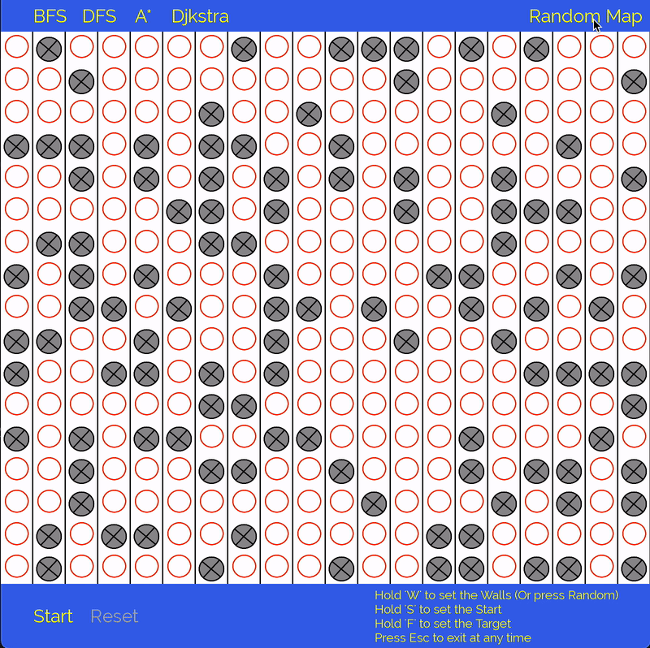
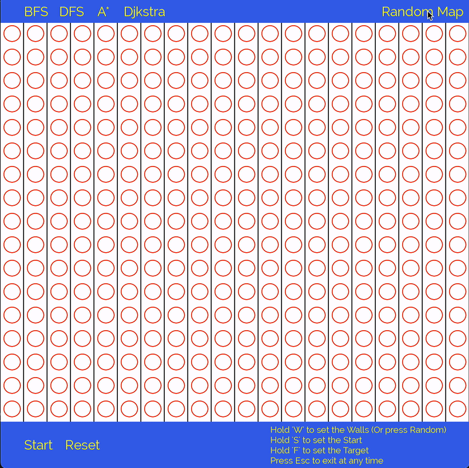

# Pathfinder

# About


This educational project introduces interactive visualizations of well-known and widely used path-finding algorithms used on Graphs.
Applications of presented algorithms are widely spread in the areas such as: Games, Scheduling / Assignment Problems, Social Networks, Recommendation Systems and Maps.

# Table of Contents  
[Algorithms](#algorithms)  
[Building](#Building-&-Compiling-(MacOS))  
<a name="headers"/>

# Algorithms:

## BFS

||-Uninformed Search<br>-Underlying DS: Queue<br>-Level-By-Level Node Expansion<br>-Shortest Path Guaranteed if Exists|
|------|-------|


## DFS

||-Uninformed Search<br>-Underlying DS: Stack<br>-Branch-By-Branch Node Expansion<br>-Shortest Path Not Guaranteed if Exists|
|--|--|


## A-Star

||-Informed Search<br>-Underlying DS: Queue<br>-Heuristic-Based Node Expansion<br>-Shortest Path Guaranteed if Exists|
|--|--|


## Djkstra (WIP)


# Repository Contents:


# Building & Compiling (MacOS)

### 1. Install SFML via Homebrew

Run the following in your terminal:

```
brew install sfml
```

By default, SFML will be installed in the following folder on your machine:

/usr/local/Cellar/sfml/

### 2. Compile and Run 

Indicate Include and Library paths to the compiler:
```
g++ -std=c++11 main-visual.cpp -I /usr/local/Cellar/sfml/2.5.1_1/include -L /usr/local/Cellar/sfml/2.5.1_1/lib -lsfml-graphics -lsfml-window -lsfml-system
```
Run the program:
```
./a.out
```
# Known Issues:


# TODO:

- [ ] DJkstra
- [ ] Verify BFS & DFS
- [ ] Verify AStar
- [ ] REPLACE Repeated code (State resets / window rendering loops etc.)
- [ ] Fix AStar being trapped by a 90 degree wall
- [ ] Add CMake functionality
- [ ] Change and review all colour textures to better quality
- [ ] FIX: Button rendering seg. fault if encapsulated in a manager class (Pointers likely)
- [ ] FIX All warnings. They are potential errors
- [ ] Review Pointers

- [X] Another graph class with weight & edges support
- [X] Add edges
- [X] Some Algorithm GUI & Basic info panel
- [X] theory
- [X] FIX THE WALLS BEING IGNORED & OVERWRITTEN! -> New objects created on stack produced a problem (copies located in a vector => No reference to actual object)
- [X] Decide on & implement the final interface !!
- [X] Implement Algorithm Selection AND proper restart feature
- [X] Random Walls Generation 
- [X] Persistent Estimator Board for AStar
