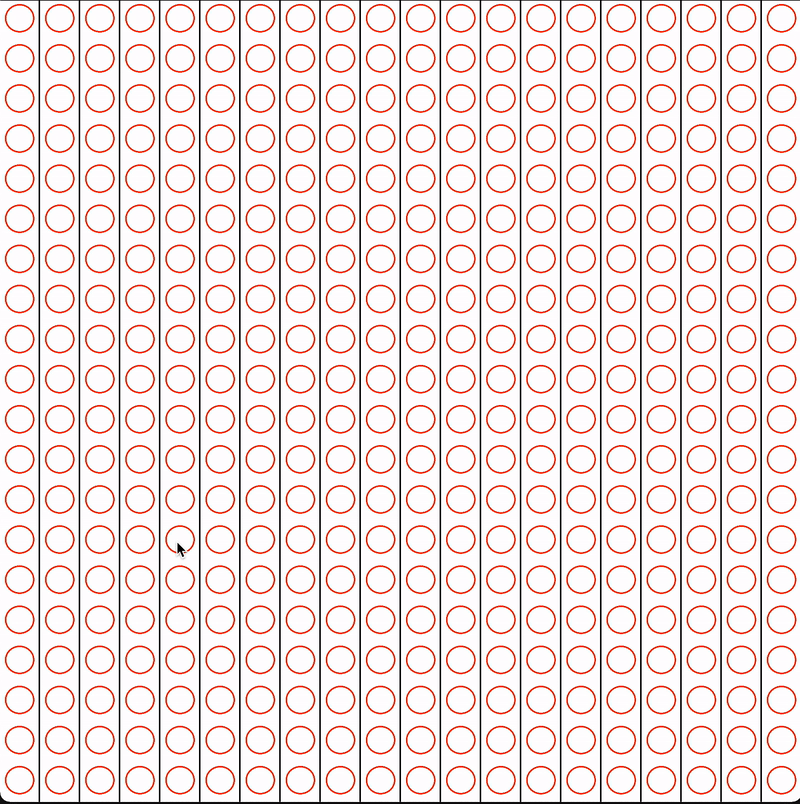
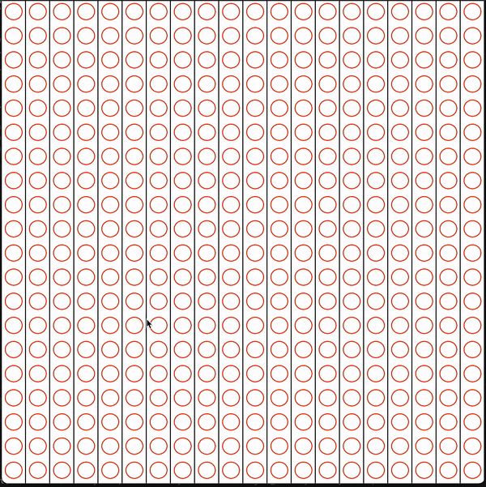

# WIP

Compiling on Mac OS (SFML installed via Homebrew)

g++ -std=c++11 main-visual.cpp -I /usr/local/Cellar/sfml/2.5.1_1/include -L /usr/local/Cellar/sfml/2.5.1_1/lib -lsfml-graphics -lsfml-window -lsfml-system

# Some Demos (WIP):

## BFS

## DFS

