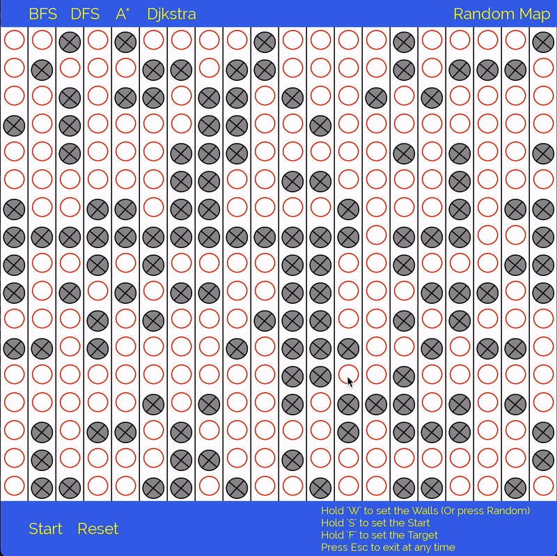
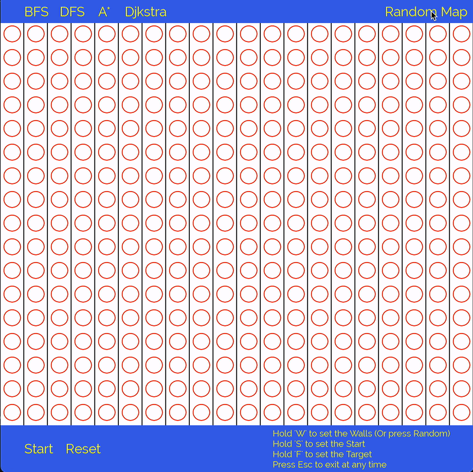

# Pathfinder

# About


This educational project features interactive visualizations of well-known and widely used path-finding algorithms used on Graphs.
Applications of presented algorithms are widely spread in the areas such as: 
- Games
- Scheduling
- Assignment Problems
- Social Networks
- Recommendation Systems and Maps.

This project is fully implemented in C++11. The Graphics library used is SFML 2.5.1

# Algorithms:

## BFS

||-Uninformed Search<br>-Underlying DS: Queue<br>-Level-By-Level Node Expansion<br>-Shortest Path Guaranteed if Exists|
|------|-------|


## DFS

||-Uninformed Search<br>-Underlying DS: Stack<br>-Branch-By-Branch Node Expansion<br>-Shortest Path Not Guaranteed if Exists|
|--|--|

## Djkstra
||-Uninformed Search<br>-Underlying DS: Priority Queue<br>-Distance-Based Node Expansion<br>-Shortest Path To Each Node Guaranteed if Exists|
|--|--|

## A-Star

||-Informed Search<br>-Underlying DS: Queue<br>-Heuristic-Based Node Expansion<br>-Shortest Path Guaranteed if Exists|
|--|--|


# Repository Contents:

```bash
├── assets-static
├── demos
└── src
    ├── Algorithms
```
The main driver program 'main-visual.cpp' and manager/interface header and source files are located in src/ directory.<br>
Algorithm Source and Header Files are located in src/Algorithms folder.

# Building & Compiling (MacOS)

### 1. Install SFML via Homebrew

Run the following in your terminal:

```bash
brew install sfml
```

By default, SFML will be installed in the following folder on your machine:

/usr/local/Cellar/sfml/

### 2. Compile and Run 

Indicate Include and Library paths to the compiler:
```
g++ -g -std=c++11 -o pathfinder.out  main-visual.cpp Application.cpp Graph.cpp GraphWeighted.cpp Algorithms/BFS.cpp Algorithms/DFS.cpp Algorithms/A-Star.cpp Algorithms/Djkstra.cpp -I /usr/local/Cellar/sfml/2.5.1_1/include -L /usr/local/Cellar/sfml/2.5.1_1/lib -lsfml-graphics -lsfml-window -lsfml-system
```
Run the program:

```
./pathfinder.out
```

# Controls
Hold 'S' key and click to select the Starting Point<br>
Hold 'F' key and click to select the Target Point<br>
Hold 'W' key and click to manually place Walls<br>
Click on 'Random Map' to generate a map<br>
Click on 'Reset' to reset the program/algorithm state<br>
Press 'Esc' key to exit the program<br>

